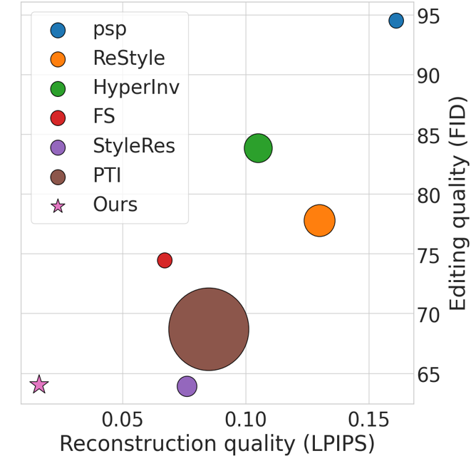
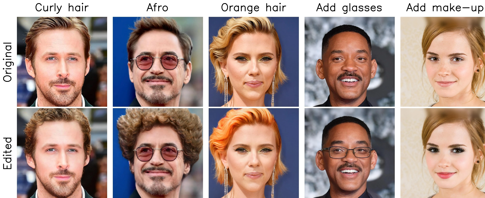

# The Devil is in the Details: StyleFeatureEditor for Detail-Rich StyleGAN Inversion and High Quality Image Editing (CVPR 2024)

<a href="https://arxiv.org/abs/2406.10601"></a>
<a href="https://colab.research.google.com/#fileId=https://github.com/AIRI-Institute/StyleFeatureEditor/blob/main/notebook/StyleFeatureEditor_inference.ipynb"></a>
<a href="https://huggingface.co/spaces/AIRI-Institute/StyleFeatureEditor"></a>
[](./LICENSE)


> The task of manipulating real image attributes through StyleGAN inversion has been extensively researched. This process involves searching latent variables from a well-trained StyleGAN generator that can synthesize a real image, modifying these latent variables, and then synthesizing an image with the desired edits. A balance must be struck between the quality of the reconstruction and the ability to edit. Earlier studies utilized the low-dimensional W-space for latent search, which facilitated effective editing but struggled with reconstructing intricate details. More recent research has turned to the high-dimensional feature space F, which successfully inverses the input image but loses much of the detail during editing. In this paper, we introduce StyleFeatureEditor -- a novel method that enables editing in both w-latents and F-latents. This technique not only allows for the reconstruction of finer image details but also ensures their preservation during editing. We also present a new training pipeline specifically designed to train our model to accurately edit F-latents. Our method is compared with state-of-the-art encoding approaches, demonstrating that our model excels in terms of reconstruction quality and is capable of editing even challenging out-of-domain examples.
> 

<p align="center">
   
  <br>
SFE is able to edit a real face image with the desired editing. It first reconstructs (inverts) the original image and then edits it according to the chosen direction. On the left is an examples of how our method works for several directions with different editing power p. On the right we display a comparison with previous approaches. LPIPS (lower is better) indicates inversion quality, while FID (lower is better) indicates editing ability. The size of markers indicates the inference time of the method, with larger markers indicating a higher time.
</p>

## Updates
**`18.06.2024`**: StyleFeatureEditor release  
**`15.07.2024`**: Add gradio demo  
**`20.07.2024`**: Add DeltaEdit editings  
**`02.08.2024`**: Add image unalignment
  
  
## Getting Started
### Prerequisites
- Linux or macOS
- NVIDIA GPU + CUDA CuDNN 
- CMAKE
- Python 3.10

### Installation

* Clone this repo:
```bash
git clone https://github.com/AIRI-Institute/StyleFeatureEditor
cd StyleFeatureEditor
```

* Install the environment:

**Step 1**, create new [conda](https://docs.anaconda.com/anaconda/install/) environment:
```bash
conda create -n sfe python=3.10 -y
source deactivate
conda activate sfe
```

**Step 2**, install all necessary libraries via script:
```bash
bash env_install.sh
```

* Download pretrained models:
```bash
git clone https://huggingface.co/AIRI-Institute/StyleFeatureEditor
cd StyleFeatureEditor && git lfs pull && cd ..
mv StyleFeatureEditor/pretrained_models pretrained_models
rm -rf StyleFeatureEditor
```

By default, we assume that all auxiliary models are downloaded and saved to the directory `pretrained_models`. However, you can use your own paths by changing the necessary values in [configs/paths.py](configs/paths.py). 

* Download full weights [optional]:
  
Weights of Inverter (result of 1 phase) and and Feature Editor (result of 2 phase) stored in `pretrained_models/sfe_inverter_light.pt` and `pretrained_models/sfe_editor_light.pt` respectively. If you need full checkpoints including weights of all parts of our pipeline (discriminator, optimisers, etc.), you can download them manually from Google Drive:

| Path | Description
| :--- | :----------
|[SFE Editor](https://drive.google.com/file/d/1D2BfXLCMotRtfbDFrmBh0faRUGSiHz2u/view?usp=sharing)  | SFE trained both phases on FFHQ dataset.
|[SFE Inverter](https://drive.google.com/file/d/1dIqojAnHdk4a__C2s8oOtu4_Y_8e85DM/view?usp=sharing) | SFE Inverter trained on FFHQ dataset first phase only.


## Inference

<p align="center">
  
  <br>
Examples of how our method works on several real images. You can find inference of these examples in our Google Colab notebook below.
</p>

### Inference Notebook
We provide a [Jupiter Notebook](https://colab.research.google.com/#fileId=https://github.com/AIRI-Institute/StyleFeatureEditor/blob/main/notebook/StyleFeatureEditor_inference.ipynb) that demonstrates the workings of our method. It includes downloading all the necessary components, running our method on several examples and creating a gif.

### Inference single sample
If you need to edit single or several images, you can use `SimpleRunner` from [runners/simple_runner.py](runners/simple_runner.py). You need to initialize it with the path to the sfe checkpoints. To edit the image you need to use `.edit()` method and pass path to the input image, name of desired editing, power of desired editing and path where to save edited image:

```python
from runners.simple_runner import SimpleRunner

runner = SimpleRunner(
    editor_ckpt_pth="pretrained_models/sfe_editor_light.pt"
)

# Inference
result = runner.edit(
    orig_img_pth="path/to/original/image.jpg",
    editing_name="editing_name",
    edited_power=1.0,
    save_pth="path/to/save/edited/image.jpg",
    align=False
)
``` 
You can find all available directions in [available_directions.txt](available_directions.txt) or by running:

```python
print(runner.available_editings())
``` 
* Alignment

If you want to edit raw image, do not forget to align it and resize it to 1024 x 1024 by passing `align=True` to `runner.edit(...)`. Alignment means that the face is cropped from the original image. If you are using SimpleRunner, the edited image is automatically inserted into the original one, and can be found in the `save_pth` parent directory with postscript `"_unaligned"`.

* Masking

If during editing some artefacts appear on the background, or wrong parts are being edited to avoid this you could use image mask to choose, which regions of the image should be edited -- just pass `use_mask=True` in `runner.edit(...)`. By default we use [FARL](https://github.com/FacePerceiver/FaRL) to separate the face zone from the background and leave the background unedited. You can control which part of the image counts as a background by passing `mask_trashold=0.35` in `runner.edit(...)` -- the more `mask_trashold`, the more is background part. 
```python
result = runner.edit(
    orig_img_pth="path/to/original/image.jpg",
    editing_name="editing_name",
    edited_power=1.0,
    save_pth="path/to/save/edited/image.jpg",
    use_mask=True,
    mask_trashold=0.995
)
``` 

After using default masker, it saves the obtained mask, cropped face, and cropped background in directory where `save_pth` is stored. If you need some specific regions to be unedited, you could pass your own mask. Just specify the path to it by passing `mask_path="path/to/mask.jpg"` in `runner.edit(...)`:

```python
result = runner.edit(
    orig_img_pth="path/to/original/image.jpg",
    editing_name="editing_name",
    edited_power=1.0,
    save_pth="path/to/save/edited/image.jpg",
    use_mask=True,
    mask_path="path/to/mask.jpg"
)
``` 

* Script

You could also use a script with the same syntaxis:

```bash
python scripts/simple_inference.py \
    --orig_img_pth=path/to/original/image.jpg \
    --editing_name=editing_name \
    --edited_power=1.0 \
    --save_pth=path/to/save/edited/image.jpg \
    --align \
    --use_mask \
    --mask_trashold=0.995 \
    --mask_path=path/to/mask.jpg
```

### Inference dataset
If you need to inference a large set of images rather than a single image, you can use [scripts/inference.py](scripts/inference.py).

First, you need to select powers and directions you want to infer and pass them to [configs/fse_inference.yaml](configs/fse_inference.yaml) as `editings_data` argument (json dict-like format as in original config). Then you need to run a script:

```bash
python scripts/inference.py \
    exp.config_dir=configs \
    exp.config=fse_inference.yaml \
    model.checkpoint_path="path/to/sfe/checkpoint" \
    data.inference_dir="path/to/input/dir" \
    exp.output_dir="path/where/to/save/results"
```

Remember that the input data should be aligned. If you are using a custom dataset (not FFHQ or CelebaHQ), do not forget to align it first.

### Metrics calculation
* Inversion metrics

To calculate inversion metrics, you could use the script [scripts/calculate_metrics.py](scripts/calculate_metrics.py):

```bash
python scripts/calculate_metrics.py \
    --orig_path="path/to/original/aligned/images/dir" \
    --reconstr_path="path/to/reconstructed/images/dir" \
    --metrics fid l2 lpips
```

Available metrics are `l2`, `lpips`, `fid`, `id`, `id_vit` and `msssim`, more details can be found in [metrics/metrcis.py](metrics/metrics.py). Metric names in `--metrics` should be separated by spaces. If you need to save information about metric values of particular images, you can add `--metrics_dir "path/where/to/save/metrics"` to arguments, this information will be saved in json format.

* Editing metric

To calculate editing metric (described in the paper) we assume that you have a dataset\subset of original CelebaHQ Images and its edited version (e.g. obtained by running `scrpits/inference.py` of our method). You will need to use the following script:

```bash
python scripts/fid_calculation.py \
    --orig_path="path/to/original/celeba/images/dir" \
    --synt_path="path/to/edited/celeba/images/dir" \
    --attr_name=Eyeglasses 
```

Attribute name should be one of the names listed in the [CelebAMask-HQ-attribute-anno.txt](CelebAMask-HQ-attribute-anno.txt). If the selected attribute was not added but removed during editing, pass `--attr_is_reversed` flag.

## Training
### Configs

We use [OmegaConf](https://github.com/omry/omegaconf) package to manage our configs. All configs can be found in [configs/](configs) directory. You can change them according to the lists of all arguments, stored in [arguments/](arguments/) directory. In addition, if you are using the script, you can change arguments directly on the command line (see examples below in section [Scripts'](#Scripts) ).

### Experiments start

For each experiment you need to pass the path to the config directory `exp.config_dir`, the name of the .yaml config `exp.config` and the name of the experiment `exp.name`. The directory associated with `exp.name` will be created in `exp.exp_dir` and all necessary results will be stored in it.

You will also need to pass path to the datasets. Pass path to the training dataset via `data.input_train_dir`, path to the validation images via `data.input_train_dir`. All inversion metrics will be calculated on the validation dataset. When using custom datasets, remember that all data should be aligned.

To track our experiments we use [Weights & Biases](https://wandb.ai/home) (option `exp.wandb` which is `True` by default). It will log repository code (at the start of the training), passed config, metrics, losses and inversion of several selected aligned images (you need to pass path to them in `data.special_dir`). If you are using W&B, do not forget to put your W&B API key into the `WANDB_KEY` environment variable.

To reimplement results of our paper, you could use default configs from [configs/](configs/).

### Scripts<a id='Scripts'></a>

* Stage 1
This stage is related to training Inverter. To start stage use:

```
python3 scripts/train.py \
    exp.config_dir=configs \
    exp.config=fse_inverter_train.yaml \
    exp.name=fse_inverter_train \
    data.input_train_dir=path/to/train/images \
    data.input_val_dir=path/to/validation/images \
    data.special_dir=path/to/several/special/images
```

* Stage 2
This stage is related to training Feature Editor. To start stage use:

```
python3 scripts/train.py \
    exp.config_dir=configs \
    exp.config=fse_editor_train.yaml \
    exp.name=fse_editor_train \
    methods_args.fse_full.inverter_pth=path/to/trained/inverter.pt \
    data.input_train_dir=path/to/train/images \
    data.input_val_dir=path/to/validation/images \
    data.special_dir=path/to/several/special/images \
    train.start_step=300001
```
If you are using W&B, it is better to pass `train.start_step` according to the last training step of Inverter to get a better visualisation of the inversion metrics.


### Method diagrams

* Training stage 1

<p align="center">
  
  <br>
<b>The Inverter training pipeline.</b> Input image $X$ is passed to Feature-Style-like backbone that predicts $w \in W^+$ and $F_{pred} \in \mathcal{F}_k$. Then $F_w = G(w_{0:k})$ is synthesized and passed with $F_{pred}$ to the Fuser that predicts $F_k$. Inversion $\widehat{X} = G(F_k, w_{k+1:N})$ is generated. Additional reconstruction $\widehat{X}_w = G(w_{0:N})$ is synthesized from w-latents only. Loss is calculated for pairs $(X, \widehat{X})$ and $(X, \widehat{X}_w)$
</p>

* Training stage 2 and Inference

<p align="center">
  
  <br>
<b>The Feature Editor training pipeline and inference.</b> To obtain <b>editing loss</b>, one need to synthesize training samples: $X_{E}$ -- training input, and $X_{E}'$  -- training target. The pre-trained encoder $E$ takes the real image $X$ and predicts $w_{E} \in W^+$. Edited direction $d \in \mathcal{D}$ is randomly sampled, after which $w_E$ is edited to $w_E' = w_E + d$. Image $X_{E}$ and intermediate features $F_{w_{E}}$ are synthesized from $w_{E}$, while $X_{E}'$ and $F_{w_{E}'}$ are synthesized from $w_{E}'$ via generator $G$. $X_{E}$ is used as input and passed to frozen Inverter $I$ that predicts $F_k$ and $w$ that is edited to $w'$ according sampled $d$. Then $\Delta$ is calculated, and Feature Editor $H$ edits $F_k$ according $\Delta$. The edited reconstruction $\widehat{X}_{E}'$ is synthesized from $F_k'$ and $w_{k+1:N}'$. <b>Editing loss </b> is calculated between $X_{E}'$ and $\widehat{X}_{E}'$. To obtain the <b>inversion loss</b>, the real image $X$ is passed to $I$ that predicts $w$ and $F_k$, $F_k$ is edited to $F_k'$ by $H$ with $\Delta = 0$. The inversion $\widehat{X}$ is synthesized from $F_k'$ and $w_{k+1:N}$. The Inversion loss is calculated between $X$ and $\widehat{X}$. <b>Inference pipeline </b> is the same as synthesizing $\widehat{X}_{E}'$ but with the assumption that $I$ takes real image $X$ instead of $X_E$.
</p>

## Hierarchy of our training class

    🏛️Training Runner                        # Training Runner responsible  for ...
      ├── 🔧 _setup_device(...)                # Setting pipeline device
      ├── 🔧 _setup_experiment_dir(...)        # Setting directory to save checkpoints
      ├── 🔧 _setup_datasets(...)              # Setting train\val\special datasets
      ├── 🔧 _setup_dataloaders(...)           # Setting train\val\special loaders
      ├── 🔧 run(...)                          # Training loop, responsible  for ...
      │   ├── 🔧 train_step(...)                  # Model forward, loss calulation, optimizer step and etc.
      │   ├── 🔧 validate(...)                    # Metrics calculation, inference special images
      │   ├── 🔧 save_..._logs(...)               # Saving training\validation logs
      │   └── 🔧 save_checkpoint(...)             # Saving models, optimizers chekpoints
      │
      ├── 🏛️ Logger                            # Gather all training logs
      ├── 🏛️ Metrics                           # Inversion metrics to validate 
      ├── 🏛️ Optimizers                        # Encoder and Discriminator optimizers
      ├── 🏛️ LossBuilder                       # Contain all losses used for training
      ├── 🏛️ LatentEditor                      # Latent Editor
      │   ├── 🏛️ Editing models                   # Contain all models for editing
      │   └── 🔧 get_[...]_editings(...)          # Editing particular directions for [...] editing method
      │
      └── 🏛️ Method                            # Method
          ├── 🔧 load_weights(...)                # Responsible for loading checkpoints
          ├── 🔧 forward(...)                     # Responsible for batch inversion via Inverter
          ├── 🏛️ Discriminator                    # StyleGAN 2 Discriminator, trainable for adv loss
          ├── 🏛️ Decoder                          # StyleGAN 2 Generator, not trainable
          ├── 🏛️ Encoder                          # Trainable part, either Inverter or Feture Editor
          ⠓⠒⠒🏛️ Inverter                         # Pretrained module used only in second stage

## Repository structure

      .
      ├── 📂 arguments                  # Contains all arguments used in training and inference
      ├── 📂 assets                     # Folder with method preview and example images
      ├── 📂 configs                    # Includes configs (associated with arguments) for training and inference
      ├── 📂 criteria                   # Contains original code for used losses and metrics
      ├── 📂 datasets                   
      │   ├── 📄 datasets.py                # A branch of custom datasets 
      │   ├── 📄 loaders.py                 # Custom infinite loader
      │   └── 📄 transforms.py              # Transforms used in SFE
      │
      ├── 📂 editings                   # Includes original code for various editing methods and an editor that applies them
      │   ├── ...
      │   └── 📄 latent_editor.py           # Implementation of module that edits w or stylespace latents 
      │
      ├── 📂 metrics                    # Contains wrappers over original code for all used inversion metrics
      ├── 📂 models                     # Includes original code from several previous inversion methods 
      │   ├── ...
      │   ├── 📂 farl                       # Modified FARL module, used to search face mask
      │   ├── 📂 psp
      │   │   ├── 📂 encoders                   # Contains all the Inverter, Feature Editor and E4E parts
      │   │   └── 📂 stylegan2                  # Includes modified StyleGAN 2 generator 
      │   │ 
      │   └── 📄 methods.py                  # Contains code for Inverter and Feature Editor modules
      │   
      ├── 📂 notebook                   # Folder for Jupyter Notebook and raw images
      ├── 📂 runners                    # Includes main code for training and inference pipelines
      ├── 📂 scripts                    # Script to ...
      │   ├── 📄 align_all_parallel.py       # Align raw images 
      │   ├── 📄 calculate_metrics.py        # Inversion metrics calculation
      │   ├── 📄 fid_calculation.py          # Editing metric calculation
      │   ├── 📄 inference.py                # Inference large set of data with several directions
      │   ├── 📄 simple_inference.py         # Inference single image with one direction and mask
      │   └── 📄 train.py                    # Start training process 
      │   
      ├── 📂 training                   
      │   ├── 📄 loggers.py                  # Code for loggers used in training
      │   ├── 📄 losses.py                   # Wrappers over used losses  
      │   └── 📄 optimizers.py               # Wrappers over used optimizers 
      │   
      ├── 📂 utils                                # Folder with utility functions
      ├── 📜 CelebAMask-HQ-attribute-anno.txt     # Matches between CelebA HQ images and attributes
      ├── 📜 available_directions.txt             # Info about available editings directions
      ├── 📜 requirements.txt                     # Lists required Python packages
      └── 📜 env_install.sh                       # Script to install necessary enviroment

## References & Acknowledgments

The code structure of this repository is heavily based on [pSp](https://github.com/eladrich/pixel2style2pixel) and [e4e](https://github.com/omertov/encoder4editing).

The project has also been inspired by a number of existing inversion techniques, using the source code of several prominent examples. These include [HyperInverter](https://github.com/VinAIResearch/HyperInverter), [FeatureStyleEncoder](https://github.com/InterDigitalInc/FeatureStyleEncoder) and [StyleRes](https://github.com/hamzapehlivan/StyleRes).

## Citation

If you use this code for your research, please cite our paper:
```
@InProceedings{Bobkov_2024_CVPR,
    author    = {Bobkov, Denis and Titov, Vadim and Alanov, Aibek and Vetrov, Dmitry},
    title     = {The Devil is in the Details: StyleFeatureEditor for Detail-Rich StyleGAN Inversion and High Quality Image Editing},
    booktitle = {Proceedings of the IEEE/CVF Conference on Computer Vision and Pattern Recognition (CVPR)},
    month     = {June},
    year      = {2024},
    pages     = {9337-9346}
}
```
